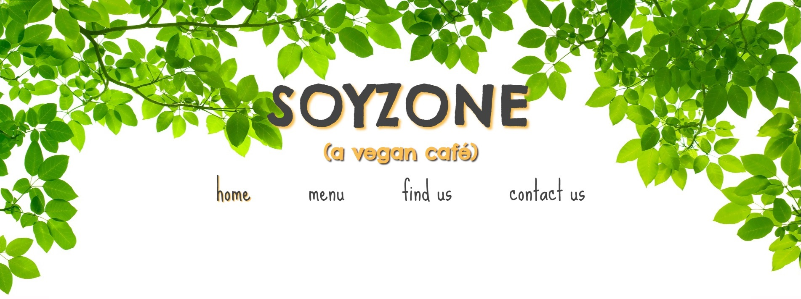
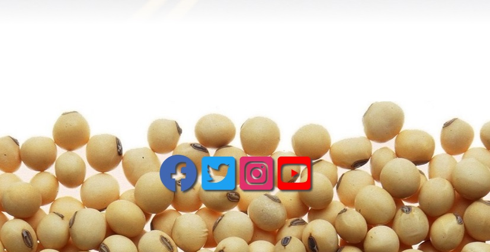
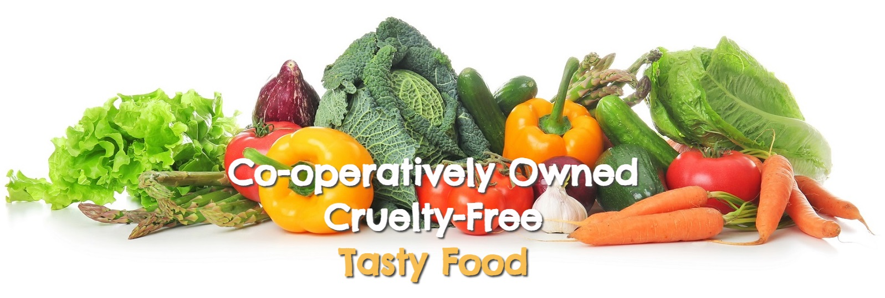
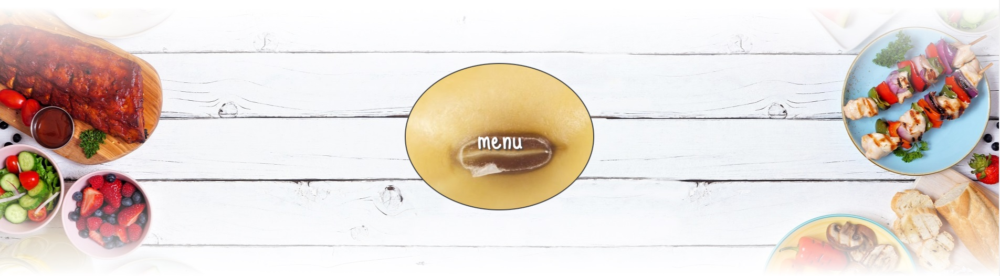
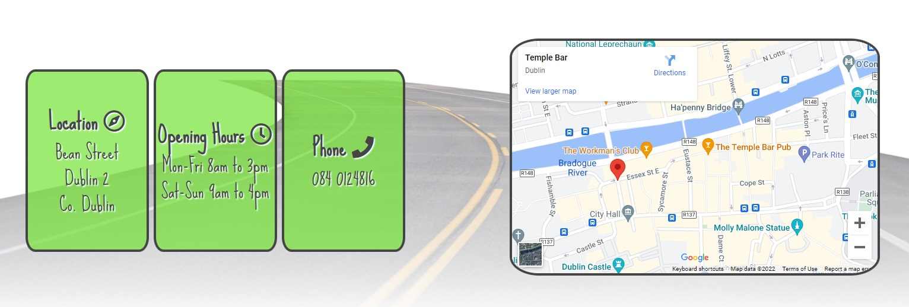

# Soyzone
Soyzone is a brand new vegan café that has opened in the heart of Dublin City, and this is its official website.

The café is targeted towards both vegans and non-vegans. The café's primary goals are to 1. provide another option for existing vegans, 2. add momentum to the increasing popularity of veganism, 3. to show non-vegans that becoming vegan needn't be difficult or entail any kind of sacrifice, and 4. to counter the perception that veganism is elitist and holier-than-thou. 

The site itself serves to promote, and provide information about, the café, while also trying to convey its atmosphere, as well as satisfying the four goals above.

## Features

### Existing Features

The <strong>header</strong> is used across the site, and contains the site logo and a navigation menu. It is the first thing a visitor to the site will see.

The header is bright and colourful, with the leaves creating a sense of being outside on a nice day. The fonts are friendly and non-threatening, and the colours used are soft and recessive. Together, these visual aspects make the visitor feel comfortable and relaxed. Moreover, there is a lot of space in the header, and the visitor is not bombarded with information. The header feels airy and peaceful. The spatial openness creates a sense of emotional openness also - as though anyone is welcome.

The subheading "(A vegan café)" adds light humour to the header, further creating an atmosphere of friendliness and warmth, rather than intensity. This subheading was also necessary in order to ensure that the website's purpose is immediately apparent to a visitor. The heading itself is intended to be humorous, too. The choice of font for these elements further communicates the fact that they are intended to be humorous.

The navigation menu can be used to return to the home page, or to navigate to the Menu and Contact Us pages, or to jump to the Find Us section of the home page. The links are ordered in terms of priority. People wouldn't be interested in knowing where to find the café if they did not know what kind of food and drink it offered, so the menu page precedes the jump link to the Find-Us section. They read the menus, and if they like what they see, they seek out the location of the café. The Contact Us page is the last link in the row, because it is more likely to be used after a person has visited the café itself. It is not likely that people will use it to ask about information that is already in the Find-Us section.

The <strong>footer</strong> is also used across the site. It contains links for four separate social media accounts associated with the page.

The footer is similarly minimalistic. The background image is of a heap of soybeans, and it serves to enclose or bookend the page. This image adds to the light-heartedness of the site, and makes it more approachable and friendly, rather than intimidating and exclusive.

The four links are coloured according to the official colours of each social media site in order to make them more easily identifiable. Visitors are less likely to click on the wrong link, and are therefore less likely to experience frustration while using the site. Each link glows when hovered over, which makes them more visible, as well as more tactile. I believe little things like this make a user's experience of the website a more pleasurable one.

The <strong>Home</strong> page consists of three sections: A small introductory section, a section containing a link to the menu page, and a find-us section containing the address and phone number of the café, as well as its opening hours.

The <strong>introductory section</strong> is non-interactive and features a few lines that give the visitor an idea of what to expect from the café, and uses a background image of a cornucopia of vegetables. The text encapsulates the ethos of the café: ethics <em>and</em> happiness/pleasure in life, not either/or. This section is a guarantee to vegan customers, but it is also intended to be enlightening to people who don't understand or know much about the lifestyle. Indeed, it is a truthful advertisement for the lifestyle, which some believe to be a painful, self-sacrificial thing, or anti-human in nature. The text describes serious things, but the bright visuals and the line "Tasty Food" offset this seriousness somewhat. Furthermore, this part is kept brief, so as not to overwhelm or frustrate viewers.

The <strong>menu link section</strong> exists because of the importance of the menu. It should be possible for the visitor to the site to be able to easily access the menu, as it is arguably the most important part. 

Adding this section was also an opportunity to add more visual flair to the site. The central button that links to the menu page is a big soybean that animates when hovered over, and it makes the site more fun/amusing.

The <strong>find us section</strong> contains the address, opening hours, and phone number of the café. As with the navigation bar, this section follows from the menu link as, while it is important, the menu is of greater importance, for reasons I have explained above. 

This section is slightly more visually busy than the previous sections, due mostly to the embedded Google Map. However, each piece of information is discrete, and has its own container, which I believe makes the information more digestible, as well as more visually intuitive. These qualities are enhanced by the use of icons.

Much of the background images have a white colour gradient laid over them, and as a result, the images don't have hard borders or edges, and everything appears to flow together. This has the effect of softening the site, and again, making it non-threatening. The site feels peaceful, light-hearted, carefree, and not without a sense of humour, which is supposed to reflect how the actual café experience would ideally feel.

