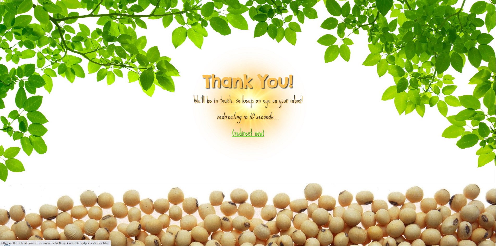

# Soyzone
Soyzone is a brand new vegan café that has opened in the heart of Dublin City, and this is its official website.

The café is targeted towards both vegans and non-vegans. The café's primary goals are to 1. provide another option for existing vegans, 2. add momentum to the increasing popularity of veganism, 3. to show non-vegans that becoming vegan needn't be difficult or entail any kind of sacrifice, and 4. to counter the perception that veganism is elitist and holier-than-thou. 

The site itself serves to promote, and provide information about, the café, while also trying to convey its atmosphere, as well as satisfying the four goals above.

## Technologies used

<ul>
    <li>Hypertext Markup Language (HTML)</li>
    <li>Cascading Style Sheets (CSS)</li>
    <li>Markdown</li>
    <li>GitHub</li>
    <li>GitPod</li>
    <li>Git</li>
</ul>

## Features

### Existing Features

The <strong>header</strong> is used across the site, and contains the site logo and a navigation menu. It is the first thing a visitor to the site will see.

The header is bright and colourful, with the leaves creating a sense of being outside on a nice day. The fonts are friendly and non-threatening, and the colours used are soft and recessive. Together, these visual aspects make the visitor feel comfortable and relaxed. Moreover, there is a lot of space in the header, and the visitor is not bombarded with information. The header feels airy and peaceful. The spatial openness creates a sense of emotional openness also - as though anyone is welcome.

The subheading "(A vegan café)" adds light humour to the header, further creating an atmosphere of friendliness and warmth, rather than intensity. This subheading was also necessary in order to ensure that the website's purpose is immediately apparent to a visitor. The heading itself is intended to be humorous, too. The choice of font for these elements further communicates the fact that they are intended to be humorous.

The navigation menu can be used to return to the home page, or to navigate to the Menu and Contact Us pages, or to jump to the Find Us section of the home page. The links are ordered in terms of priority. People wouldn't be interested in knowing where to find the café if they did not know what kind of food and drink it offered, so the menu page precedes the jump link to the Find-Us section. They read the menus, and if they like what they see, they seek out the location of the café. The Contact Us page is the last link in the row, because it is more likely to be used after a person has visited the café itself. It is not likely that people will use it to ask about information that is already in the Find-Us section.

The navigation bar also highlights the link to the page that you are currently on.

The <strong>footer</strong> is also used across the site. It contains links for four separate social media accounts associated with the page.

The footer is similarly minimalistic. The background image is of a heap of soybeans, and it serves to enclose or bookend the page. This image adds to the light-heartedness of the site, and makes it more approachable and friendly, rather than intimidating and exclusive.

The four links are coloured according to the official colours of each social media site in order to make them more easily identifiable. Visitors are less likely to click on the wrong link, and are therefore less likely to experience frustration while using the site. Each link glows when hovered over, which makes them more visible, as well as more tactile. I believe little things like this make a user's experience of the website a more pleasurable one.

As with the header and the footer, there is also a small <strong>"you are here"</strong> message box that is overlaid on each page. This box tells the user which page they are currently on. I opted for this rather than a fixed header, because I felt that it was less obtrusive. Its red colour makes it stand out, and makes up for its small size. Hovering over it causes it to become more opaque, and to pop out, just in case a visitor finds that it is not visible enough.

This message ensures that the visitor knows what page they are on at all times.

It is also worth mentioning that the corners of the box are rounded - something that you will see throughout the website. I feel that this contributes to reducing or removing any intensity from the site, and making it feeling like a safe place. It perhaps helps people to understand, on an emotional level, that veganism is nothing to fear.

The <strong>Home</strong> page consists of three sections: A small introductory section, a section containing a link to the menu page, and a find-us section containing the address and phone number of the café, as well as its opening hours.

The <strong>introductory section</strong> is non-interactive and features a few lines that give the visitor an idea of what to expect from the café, and uses a background image of a cornucopia of vegetables. The text encapsulates the ethos of the café: ethics <em>and</em> happiness/pleasure in life, not either/or. This section is a guarantee to vegan customers, but it is also intended to be enlightening to people who don't understand or know much about the lifestyle. Indeed, it is a truthful advertisement for the lifestyle, which some believe to be a painful, self-sacrificial thing, or anti-human in nature. The text describes serious things, but the bright visuals and the line "Tasty Food" offset this seriousness somewhat. Furthermore, this part is kept brief, so as not to overwhelm or frustrate viewers.

The <strong>menu link section</strong> exists because of the importance of the menu. It should be possible for the visitor to the site to be able to easily access the menu, as it is arguably the most important part. 

Adding this section was also an opportunity to add more visual flair to the site. The central button that links to the menu page is a big soybean that animates when hovered over, and it makes the site more fun/amusing.

The <strong>find us section</strong> contains the address, opening hours, and phone number of the café. As with the navigation bar, this section follows from the menu link as, while it is important, the menu is of greater importance, for reasons I have explained above. 

This section is slightly more visually busy than the previous sections, due mostly to the embedded Google Map. However, each piece of information is discrete, and has its own container, which I believe makes the information more digestible, as well as more visually intuitive. These qualities are enhanced by the use of icons.

Much of the background images have a white colour gradient laid over them, and as a result, the images don't have hard borders or edges, and everything appears to flow together. This has the effect of softening the site, and again, making it non-threatening. The site feels peaceful, light-hearted, carefree, and not without a sense of humour, which is supposed to reflect how the actual café experience would ideally feel.

The <strong>menu</strong> page contains information about the food and drink that can be enjoyed at the café. There are four menus - breakfast, lunch, drinks, and sweets. These menus are separated into four boxes with headings, and each box has a scroll bar to enable a visitor to view everything on a given menu. The colour-scheme of the boxes matches that of the header, but with minimal use of white.

There are lots of options to choose from on the menu, as well as vegan versions of many popular meals and types of food. This is sure to please vegans who might be struggling to find alternatives to things they enjoyed as non-vegans, and it should also open the eyes of those who assume that a plant-based diet is restrictive and limited.

The <strong>contact us</strong> page contains a form that visitors can complete and submit. There are just four fields that they must fill - first name, last name, email address, and then the message they wish to send. All four fields are required, and the form cannot be submitted without them, but because this is only a small amount of information, visitors are not likely to become frustrated or exasperated. What's more, in the spirit of openness, I did not want to discourage people from giving feedback and/or voicing their opinions. Lengthy forms can sometimes be a barrier to this, and intentionally so.

The look and feel of the form is in-keeping with the general mood of the website. It has a cartoony look - it is light-hearted. The placeholder text in the message field introduces more light humour. 

The submit button is "animated", which, like the menu button on the home page, gives the form a fun or amusing quality. Similarly, each text field responds to being clicked into by changing colour and taking on a 3D appearance. Not only are these little details pleasing to the eye and satisfying, they also provide visual feedback to the visitor. The website is responding to them - it is attentive to them, rather than indifferent. They know that it is doing what they want it to do, and they also feel welcome.

Finally, there is the <strong>confirmation</strong> page, which appears for 4 seconds once the visitor has submitted their message on the contact us page.

This page is an extension of the contact us page, and serves to give even more feedback to the user. Together with the feedback given by the form elements on the contact us page, this page makes the visitor feel reassured that their message will not just be sent into the ether.

The image of a flash of light is eye-catching, and ensures that the visitor will see the message and learn from it that their message has been received.

### Features yet to be implemented

I plan to add a <strong>resources</strong> page to this website. Soyzone is first and foremost trying to make the world a better place. It is only a business because it has to be. 

The resources page will contain links to articles and other websites, embedded videos, and book and documentary recommendations. It will serve an educational purpose, containing resources that explain to people why they ought to go vegan, how they can stay healthy and happy <em>as</em> a vegan. 

Deciding to go vegan can be overwhelming, because there are many dimensions to it (nutritional, environmental, ethical, etc.). This page will compile all the best, clearest resources in one place so that people can learn what they need to know without wasting time googling, reading confusing articles, and watching confusing videos. It will hopefully turn those who make use of it into principled and informed vegans.

## Testing

<em>Please refer to TEST.md.</em>

## Deployment

The process followed in order to deploy this project to GitHub Pages was as follows:
<ol>
    <li>I navigated to GitHub.com and logged in to my account.</li>
    <li>Once I was logged in, I navigated to the repository for this project.</li>
    <li>At the page for the project repository, I entered the Settings menu.</li>
    <li>In the Settings menu, I clicked on the Pages section in the left-hand pane.</li>
    <li>In the Pages section, I left the Source drop-down menu set to "Deploy from a branch".</li>
    <li>For Branch, I selected "main".</li>
    <li>Finally, I clicked Save. After a few moments, the URL for my project went live. Please find it below.</li>
</ol>

Live link to this project: https://chrislplumb91.github.io/soyzone/

## Credits

### Content
The fonts used across the website were taken from Google Fonts.
- [Chelsea Market](https://fonts.google.com/specimen/Chelsea+Market)
- [Sue Ellen Francisco](https://fonts.google.com/specimen/Sue+Ellen+Francisco)

The icons used in the Find-Us section and in the footer were taken from Font Awesome.
- [Compass](https://fontawesome.com/v5/icons/compass?s=regular)
- [Clock](https://fontawesome.com/v5/icons/clock?s=regular)
- [Phone](https://fontawesome.com/v5/icons/phone?s=solid)
- [Facebook](https://fontawesome.com/v5/icons/facebook?s=brands)
- [Twitter-square](https://fontawesome.com/v5/icons/twitter-square?s=brands)
- [Instagram-square](https://fontawesome.com/v5/icons/instagram-square?s=brands)
- [Youtube-square](https://fontawesome.com/v5/icons/youtube-square?s=brands)

The menus on the menu page took their options from the following pages:
- [Freshii](https://www.freshii.ie/menu)
- [Kale + Coco](https://www.kaleandcoco.com/menu)
- [Nutbutter](https://nutbutter.ie/menu/)
- [Pretend](https://pretend.ie/index.php/menu)
- [Tang](https://www.tang.ie/menus)
- [V-Face](https://vfacelimited2.orderingclub.com/en/vfacelimited1?menu=619b84900899787d1daec611_2)
- [Vegan Sandwich](https://vegansandwich.co/pages/menu)
- [Veginity](https://www.veginity.com/)

### Media
The following images were licensed from Adobe Stock:
- [Green Leaves border, by tanatat (header)](https://stock.adobe.com/ie/contributor/201968479/tanatat?load_type=author&prev_url=detail&asset_id=27846023)
- [Fresh vegetables on white background, by Pixel-Shot (intro section)](https://stock.adobe.com/ie/contributor/207588960/pixel-shot?load_type=author&prev_url=detail&asset_id=208878179)
- [Summer BBQ or picnic food, by Jenifoto (menu link section)](https://stock.adobe.com/ie/contributor/201964585/jenifoto?load_type=author&prev_url=detail&asset_id=349054311)
- [Winding asphalt road with yellow symbol, by Mumemories (find us section)](https://stock.adobe.com/ie/contributor/205084595/mumemories?load_type=author&prev_url=detail&asset_id=331281588)
- [A stack of white envelopes, by MohamadFaizal (contact us page)](https://stock.adobe.com/ie/contributor/206896308/mohamadfaizal?load_type=author&prev_url=detail&asset_id=485447955)
- [Flash yellow sun, by ANATOLII (confirmation page)](https://stock.adobe.com/ie/contributor/209881594/anatolii?load_type=author&prev_url=detail&asset_id=478184661)

The following images were taken from around the web through Google Image Search:
- [Soybean, from an article on seedworld.com (menu link section)](https://seedworld.com/burrus-market-donmario-soybeans/)
- [Food laid out on table, from the twitter account of Tas Restaurants (menu page)](https://mobile.twitter.com/tasrestaurantuk/status/953290589151297537/photo/1)
- [Pile of soybeans, from an article on ecofarmingdaily.com (footer)](https://www.ecofarmingdaily.com/grow-crops/grow-soybeans/soybean-crop-science/how-soybeans-are-used-as-food/)